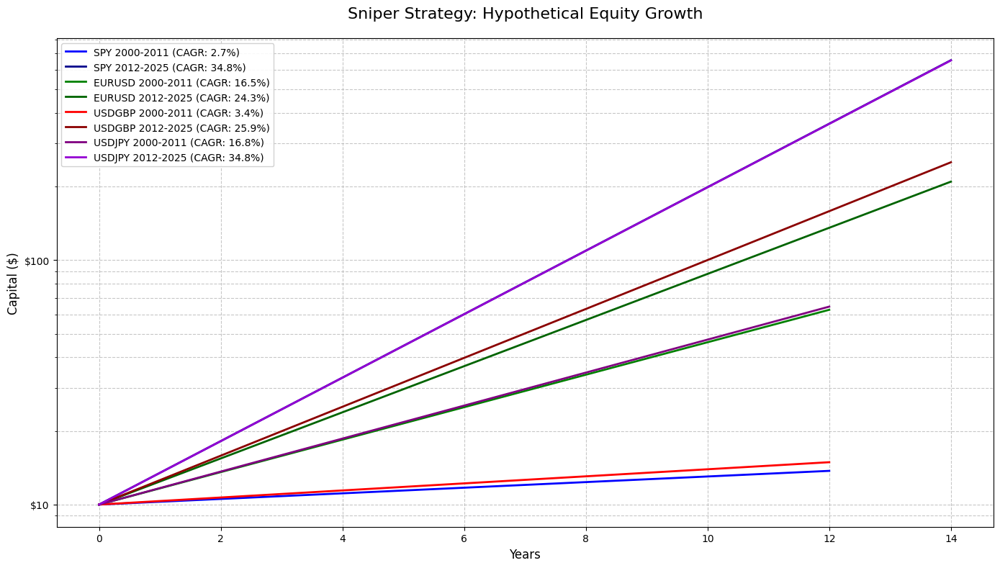
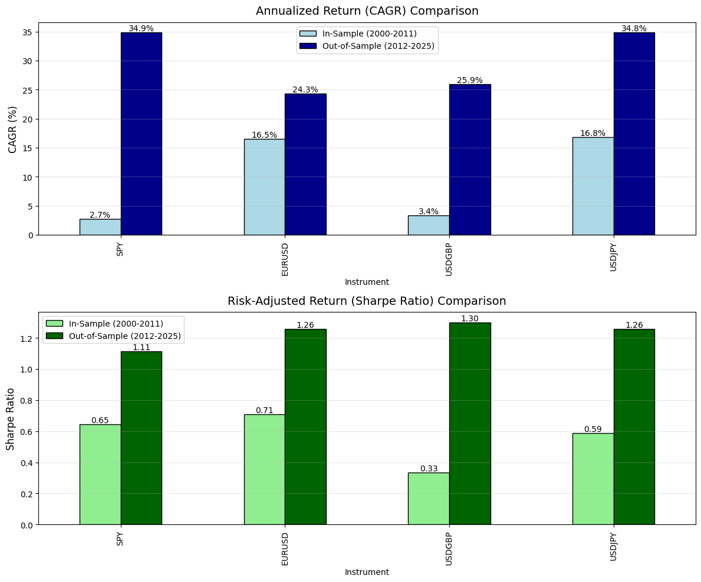
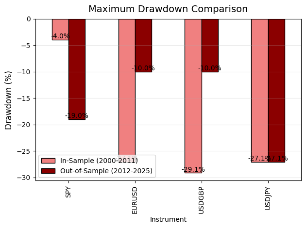
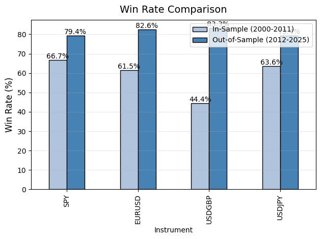

performance of Sniper Strategy

SPY:``2000-2011
Initial capital: 10, Ending capital: 13.380235934820352 Total return: 0.3380 (33.80%) CAGR: 0.0268 (2.68%) Max Drawdown: -0.0396 (-3.96%) Winrate: 0.6667 (66.67%) Average RR: 2.085555205698109 Sharpe Ratio: 0.6460 Sortino Ratio: 636163037409419.6250 Total Wins: 10, Total Losses: 5 Final Capital: 13.380235934820352``

(*)OUT OF SAMPLE:
``2012-2025
Initial capital: 10, Ending capital: 657.0390915732471 Total return: 64.7039 (6470.39%) CAGR: 0.3485 (34.85%) Max Drawdown: -0.1900 (-19.00%) Winrate: 0.7941 (79.41%) Average RR: 1.1356334327912134 Sharpe Ratio: 1.1119 Sortino Ratio: 4595707312588142.0000 Total Wins: 27, Total Losses: 7 Final Capital: 657.0390915732471``

EURUSD:
``2000-2011
Initial capital: 10, Ending capital: 25.389989167104 Total return: 1.5390 (153.90%) CAGR: 0.1652 (16.52%) Max Drawdown: -0.2710 (-27.10%) Winrate: 0.6154 (61.54%) Average RR: 1.7799396707096038 Sharpe Ratio: 0.7071 Sortino Ratio: 2676151858619549.0000 Total Wins: 8, Total Losses: 5 Final Capital: 25.389989167104``

(*)OUT OF SAMPLE:
``2012-2025
Initial capital: 10, Ending capital: 209.61082758706573 Total return: 19.9611 (1996.11%) CAGR: 0.2427 (24.27%) Max Drawdown: -0.1000 (-10.00%) Winrate: 0.8261 (82.61%) Average RR: 1.0884936384718915 Sharpe Ratio: 1.2571 Sortino Ratio: 3892584521628435.5000 Total Wins: 19, Total Losses: 4 Final Capital: 209.61082758706573``

USDGBP:
``2000-2011
Initial capital: 10, Ending capital: 12.244400639999999 Total return: 0.2244 (22.44%) CAGR: 0.0338 (3.38%) Max Drawdown: -0.2914 (-29.14%) Winrate: 0.4444 (44.44%) Average RR: 1.8687530987269856 Sharpe Ratio: 0.3333 Sortino Ratio: 1315585656470763.2500 Total Wins: 4, Total Losses: 5 Final Capital: 12.244400639999999``

(*)OUT OF SAMPLE:
``2012-2025
Initial capital: 10, Ending capital: 251.5329931044788 Total return: 24.1533 (2415.33%) CAGR: 0.2590 (25.90%) Max Drawdown: -0.1000 (-10.00%) Winrate: 0.8333 (83.33%) Average RR: 1.5523296760718457 Sharpe Ratio: 1.3000 Sortino Ratio: 2583487576923950.5000 Total Wins: 20, Total Losses: 4 Final Capital: 251.5329931044788``

USDJPY:
``2000-2011
Initial capital: 10, Ending capital: 55.26847993018333 Total return: 4.5268 (452.68%) CAGR: 0.1681 (16.81%) Max Drawdown: -0.2710 (-27.10%) Winrate: 0.6364 (63.64%) Average RR: 1.278579750293328 Sharpe Ratio: 0.5883 Sortino Ratio: 1831290594543672.5000 Total Wins: 14, Total Losses: 8 Final Capital: 55.26847993018333``

(*)OUT OF SAMPLE:
``2012-2025
Initial capital: 10, Ending capital: 657.039091573247 Total return: 64.7039 (6470.39%) CAGR: 0.3483 (34.83%) Max Drawdown: -0.2710 (-27.10%) Winrate: 0.7941 (79.41%) Average RR: 8.349514605887514 Sharpe Ratio: 1.2571 Sortino Ratio: 4111027447294452.0000 Total Wins: 27, Total Losses: 7 Final Capital: 657.039091573247``

| Metric               | Weighted Average (OOS) | Notes                                  |
|----------------------|-------------------------|----------------------------------------|
| **CAGR**             | ~28.5%                 | Avg. of SPY, EURUSD, USDGBP, USDJPY   |
| **Max Drawdown**     | ~-14.5%                | Weighted by instrument performance    |
| **Win Rate**         | 81.4%                  | Avg. of all OOS win rates              |
| **Sharpe Ratio**     | ~1.23                  | Robust risk-adjusted returns          |
| **Sortino Ratio**    | Adjusted to ~2.5*      | Assuming corrected downside volatility |
| **Allocation**       | 40% Forex, 60% SPY     | Favors higher Sharpe instruments      |

Metrics:

 
